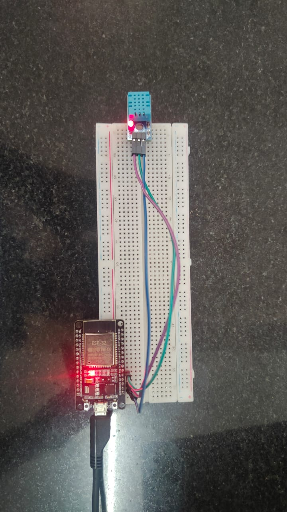
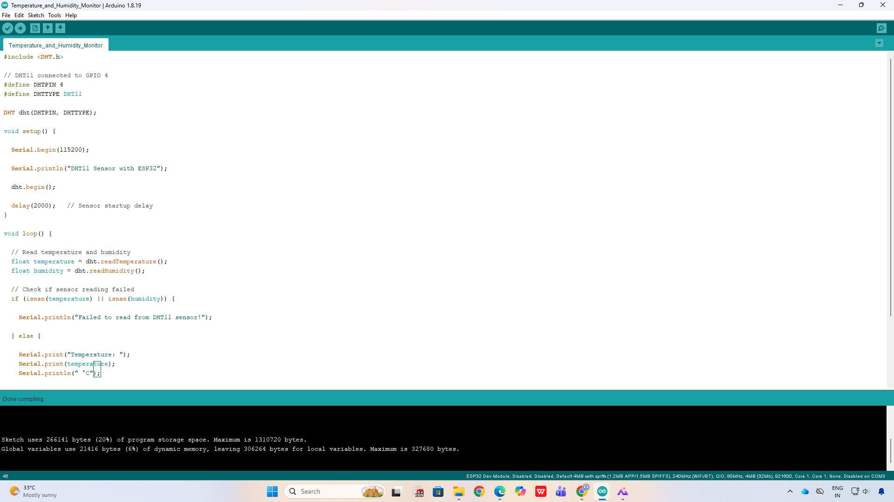
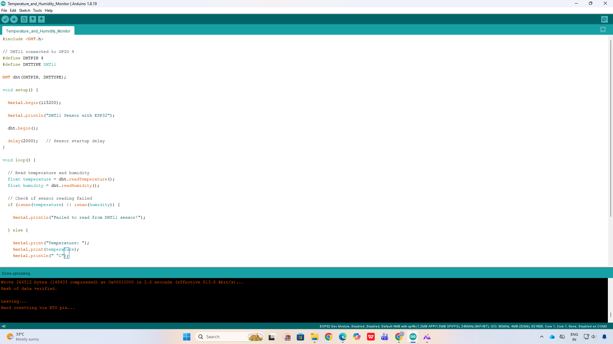
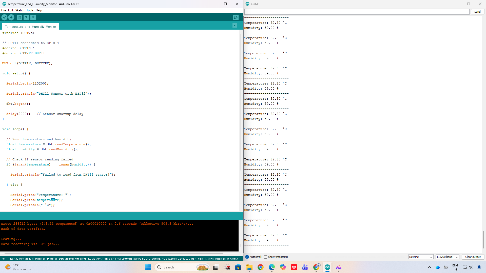

# ESP32 Temperature and Humidity Monitor 

This IoT project uses an ESP32 and DHT11 sensor to measure real-time temperature and humidity.

## Components Used
- ESP32 Dev Module
- DHT11 Sensor
- Breadboard
- Jumper Wires
- USB Cable

---

##  Circuit Connections

| DHT11 Pin | ESP32 Pin |
|-----------|------------|
| VCC       | 3.3V       |
| GND       | GND        |
| DATA      | D4     |

---

##  Features
- Real-time temperature monitoring
- Real-time humidity monitoring
- Serial Monitor output
- Easy ESP32 integration

---

##  Software Used
- Arduino IDE
- ESP32 Board Package
- DHT Sensor Library

---

##  Project Images

### Circuit Setup

### Code Compilation

### Uploading to ESP32

### Serial Monitor Output

---

##  Sample Output

Temperature: 32.30 °C  
Humidity: 59.00 %

---

##  Future Improvements
- Upload data to ThingSpeak
- Add OLED display
- Mobile app monitoring
- Smart weather station integration

---

##  Developed By
Parthiv Murugesh